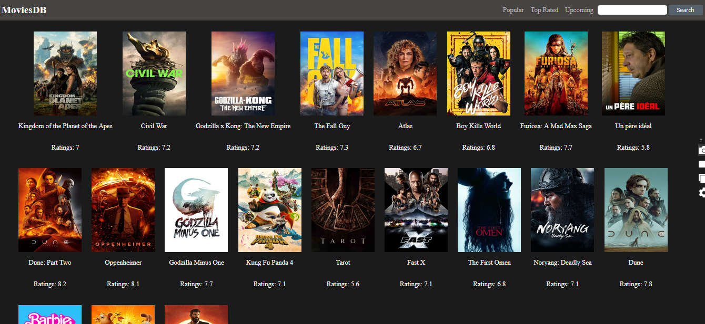

The objective of the Movies DB web application is to provide users with an engaging and intuitive platform to explore and discover a wide range of movies. This application offers a comprehensive list of popular, top-rated, and upcoming movies. Users can view detailed information about each movie, including descriptions, ratings, and release dates. Additionally, the app features a robust search functionality that allows users to easily find specific movies based on their preferences. The goal is to create a seamless and enjoyable movie browsing experience leveraging the power and flexibility of React JS.

### Refer to the image below:

      

 

### Design Files

popular

 
Add the design files according to the route (if any) and responsiveness

[Extra Small (Size < 576px) and Small (Size >= 576px)](./public/images/mobileView.png)

- [Medium (Size >= 768px), Large (Size >= 992px) and Extra Large (Size >= 1200px)](./public/images/largeView.png)

### Set Up Instructions

Click to view

- Download dependencies by running `npm install`
- Start up the app using `npm start`

### Assignment Completion Instructions

Functionality added

 

The app must have the following functionalities:

- Navigate through pages with use of react router dom.
- Popular Movie Page
- Top Rated Movie Page
- Upcoming Movie Page
- Search Functionality
- Responsiveness
- Pagination

### Assignment Completion Checklist

Click to view

- The completion Checklist includes the below-mentioned points
  - I have completed all the functionalities asked in the assignment
  - I have used only the resources (Frameworks, Design files, APIs, third-party packages) mentioned in the assignment
  - I have modified the README.md file based on my assignment instructions
  - I have completed the assignment On Time.
  

### Quick Tips

Click to view

 

- I have used axios a third party Pakage for fetching data from a api
- date-fns third party pakages for formatting the date

### Important Note

Click to view

 

- Search Functionality doesn't work in MovieDetailPage route

### Resources

Data Fetch URLs

 

- API KEY
  -c45a857c193f6302f2b5061c3b85e743

-Get all movies -https://api.themoviedb.org/3/movie/popular?api_key=${Api_key}&language=en-US&page=1

-Get movie detail
https://api.themoviedb.org/3/movie/${movie_id}?api_key=${Api_key}&language=en-US

-Get movie cast detail
https://api.themoviedb.org/3/movie/${movie_id}/credits?api_key=${Api_key}&language=en-US

-Get upcoming movies
https://api.themoviedb.org/3/movie/upcoming?api_key=${Api_key}&language=en-US&page=1

-Get top-rated movies
https://api.themoviedb.org/3/movie/top_rated?api_key=${Api_key}&language=en-US&page=1

-Get search result
https://api.themoviedb.org/3/search/movie?api_key=${Api_key}&language=en-US&query=${mov
ie_name}&page=1

Image URLs

 

- For Image Path:- base domain used given below
  https://image.tmdb.org/t/p/w500

Colors

- text-colors
    #fffff
    #00000

- background-color
  #464343
  rgb(27, 27, 27)
   

Add the text and background colours to be used in the assignment yourself.

Font-families

- Roboto

